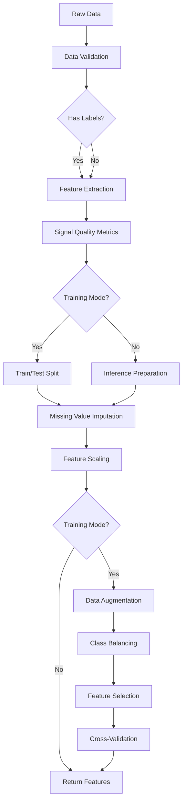
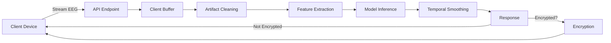
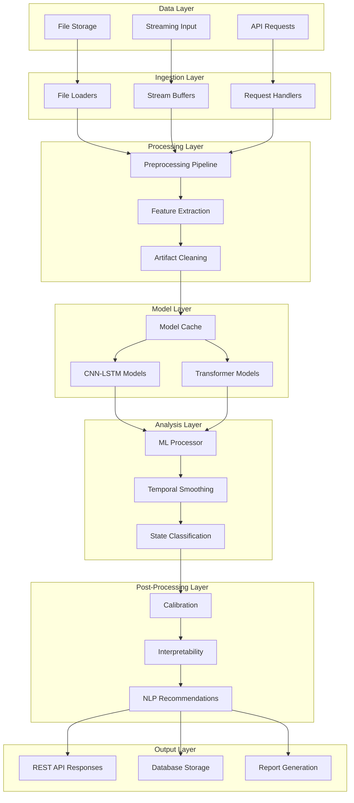

# NeuroLab AI: Comprehensive System Documentation

## 📋 Table of Contents
1. [System Overview](#system-overview)
2. [Data Formats](#data-formats)
3. [Data Ingestion](#data-ingestion)
4. [Preprocessing Pipeline](#preprocessing-pipeline)
5. [Feature Extraction](#feature-extraction)
6. [Training Process](#training-process)
7. [Model Evaluation](#model-evaluation)
8. [Inferencing & Real-time Processing](#inferencing--real-time-processing)
9. [Post-Training Processes](#post-training-processes)
10. [Key Functionalities](#key-functionalities)
11. [Architecture Summary](#architecture-summary)

---

## System Overview

**NeuroLab AI** is a sophisticated multimodal analysis platform that combines:
- **EEG (Electroencephalogram)** signal processing
- **Voice emotion detection** 
- **Mental state classification**
- **Real-time streaming analytics**
- **NLP-based recommendations**

### Mental States
The system classifies mental states into three categories:
- **State 0: Relaxed** - Calm, neutral emotional states
- **State 1: Focused** - Alert, positive, engaged states  
- **State 2: Stressed** - Anxious, fearful, negative states

---

## Data Formats

### 1. EEG Data Formats

#### **Supported File Formats**
| Format | Extension | Loader | Description |
|--------|-----------|--------|-------------|
| CSV | `.csv` | [load_csv_data()](file:///home/polo/Documents/Neurolab/ai/src/preprocessing/load_data.py#44-77) | Comma/tab/semicolon separated values |
| EDF | `.edf` | [load_edf_data()](file:///home/polo/Documents/Neurolab/ai/src/preprocessing/load_data.py#79-122) | European Data Format (requires `pyedflib`) |
| BDF | `.bdf` | [load_biosignal_data()](file:///home/polo/Documents/Neurolab/ai/src/preprocessing/load_data.py#124-151) | BioSemi Data Format (requires `mne`) |
| GDF | `.gdf` | [load_biosignal_data()](file:///home/polo/Documents/Neurolab/ai/src/preprocessing/load_data.py#124-151) | General Data Format (requires `mne`) |
| MATLAB | `.mat` | [load_matlab_data()](file:///home/polo/Documents/Neurolab/ai/src/preprocessing/load_data.py#153-215) | MATLAB matrix files (requires `scipy`) |

**Location**: [src/preprocessing/load_data.py](file:///home/polo/Documents/Neurolab/ai/src/preprocessing/load_data.py)

#### **CSV Format Requirements**
```csv
channel_1,channel_2,channel_3,...,channel_N
value_1_1,value_1_2,value_1_3,...,value_1_N
value_2_1,value_2_2,value_2_3,...,value_2_N
...
```

#### **Feature Format (Simple Mode - 5 Features)**
After processing, data is represented as 5 frequency band powers:
```python
{
    "alpha": 10.5,    # 8-13 Hz
    "beta": 15.2,     # 13-30 Hz
    "theta": 6.3,     # 4-8 Hz
    "delta": 2.1,     # 0.5-4 Hz
    "gamma": 30.5     # 30-45 Hz
}
```

#### **Complex Feature Set (930+ Features)**
When `simple_mode=False`, the system extracts comprehensive features per channel:
- **Time Domain**: mean, std, variance, skewness, kurtosis, zero-crossings, peak-to-peak, RMS
- **Frequency Domain**: band powers, spectral entropy, peak frequency, band power ratios
- **Hjorth Parameters**: activity, mobility, complexity
- **Wavelet Features**: energy, mean absolute value, std, entropy at multiple decomposition levels
- **Harmonic Features**: dominant frequency, harmonic frequencies and amplitudes
- **Phase Features**: instantaneous phase statistics, phase velocity
- **Nonlinear Features**: sample entropy, approximate entropy, permutation entropy, spectral entropy, SVD entropy
- **Cross-Channel Features**: cross-correlation, coherence, phase synchronization
- **PCA Features**: explained variance ratios across principal components

### 2. Audio Data Formats

**Supported Audio Formats**: WAV, MP3, and other formats supported by `scipy`, `soundfile`, or `librosa`

**Expected Sample Rate**: 16 kHz (automatically resampled if different)

**Location**: [src/utils/voice_processor.py](file:///home/polo/Documents/Neurolab/ai/src/utils/voice_processor.py)

---

## Data Ingestion

### 1. File-Based Ingestion

#### **Main Entry Point**
```python
from src.preprocessing import load_data

df = load_data(file_path)  # Returns pandas DataFrame
```

**Features**:
- Automatic format detection based on file extension
- Multiple delimiter support for CSV (`,`, `;`, `\t`)
- Metadata extraction (sampling frequency, channel types, recording info)
- Numeric column type enforcement
- Automatic column naming for unlabeled data

**Location**: [src/preprocessing/load_data.py](file:///home/polo/Documents/Neurolab/ai/src/preprocessing/load_data.py#L9-L41)

### 2. API-Based Ingestion

#### **REST API Endpoints**

**File Upload**:
```http
POST /upload
Content-Type: multipart/form-data

file: <eeg_data_file>
encrypt_response: boolean (optional)
```

**JSON Data**:
```http
POST /analyze
Content-Type: application/json

{
  "alpha": 10.5,
  "beta": 15.2,
  "theta": 6.3,
  "delta": 2.1,
  "gamma": 30.5,
  "subject_id": "user_123",
  "session_id": "session_456"
}
```

**Location**: [main.py](file:///home/polo/Documents/Neurolab/ai/main.py#L118-L141)

### 3. Streaming Ingestion

**Real-time streaming** with client-specific buffers:

```http
POST /api/stream
Content-Type: application/json

{
  "eeg_data": [[...], [...], ...],  # Multi-channel samples
  "client_id": "device_123",
  "clean_artifacts": true,
  "include_interpretability": false
}
```

**Features**:
- Client-specific stream buffers (up to 5000 samples)
- Adaptive window sizing based on signal characteristics
- Authentication and validation
- Optional encryption for sensitive data

**Location**: [src/api/streaming.py](file:///home/polo/Documents/Neurolab/ai/src/api/streaming.py#L80-L215)

### 4. Voice Data Ingestion

```http
POST /voice/analyze
Content-Type: multipart/form-data

file: <audio_file>
sample_rate: integer (optional)
```

**Location**: [src/api/voice.py](file:///home/polo/Documents/Neurolab/ai/src/api/voice.py#L35-L73)

---

## Preprocessing Pipeline

### Overview

The preprocessing pipeline is a multi-stage process that transforms raw EEG data into normalized, balanced, and feature-selected training data.

**Main Entry Point**: [src/preprocessing/preprocess.py:preprocess_data()](file:///home/polo/Documents/Neurolab/ai/src/preprocessing/preprocess.py#L245-L466)

### Pipeline Stages



### 1. Data Validation

**Function**: [validate_input_data()](file:///home/polo/Documents/Neurolab/ai/src/preprocessing/preprocess.py#28-98)

**Checks**:
- ✓ Data type validation (must be DataFrame)
- ✓ Target column existence
- ✓ Empty dataset detection
- ✓ Infinite value detection
- ✓ Null value analysis
- ✓ Constant column identification
- ✓ Duplicate row detection
- ✓ Class imbalance assessment (ratio \> 3:1)

**Output**: Quality metrics including:
- Per-column statistics (mean, std, min, max, null count, unique count)
- Class distribution
- Warning messages for quality issues

**Location**: [src/preprocessing/preprocess.py](file:///home/polo/Documents/Neurolab/ai/src/preprocessing/preprocess.py#L28-L97)

### 2. Feature Extraction

**Function**: [extract_features()](file:///home/polo/Documents/Neurolab/ai/src/preprocessing/features.py#322-365)

**Modes**:
1. **Simple Mode** (`simple_mode=True`): Extracts 5 core frequency band powers averaged across channels
2. **Complex Mode** (`simple_mode=False`): Extracts 930+ features per channel

**Process**:
1. Detect if data is raw time-series or pre-computed features
2. If raw time-series:
   - Segment into epochs (257 samples = 1.028s at 250Hz)
   - Extract features from each epoch
   - Return DataFrame with one row per epoch
3. If pre-computed features: return as-is

**Location**: [src/preprocessing/features.py](file:///home/polo/Documents/Neurolab/ai/src/preprocessing/features.py#L322-L364)

### 3. Signal Quality Metrics

**Function**: [compute_signal_quality_metrics()](file:///home/polo/Documents/Neurolab/ai/src/preprocessing/preprocess.py#99-125)

**Metrics Computed**:
- **SNR** (Signal-to-Noise Ratio): `10 * log10(signal_power / noise_power)`
- **Peak-to-Peak Amplitude**: `max - min`
- **Zero Crossing Rate**: Rate of sign changes
- **Signal Energy**: Sum of squared amplitudes
- **Signal Entropy**: Information content of amplitude distribution

**Location**: [src/preprocessing/preprocess.py](file:///home/polo/Documents/Neurolab/ai/src/preprocessing/preprocess.py#L99-L124)

### 4. Train/Test Split

**Function**: [split_data()](file:///home/polo/Documents/Neurolab/ai/src/preprocessing/preprocess.py#160-176)

**Parameters**:
- `test_size`: 0.2 (20% for testing)
- `stratify`: True (maintains class distribution)
- `random_state`: 42 (reproducibility)

**Location**: [src/preprocessing/preprocess.py](file:///home/polo/Documents/Neurolab/ai/src/preprocessing/preprocess.py#L160-L175)

### 5. Missing Value Imputation

**Strategy**: Constant imputation with fill value of 0

**Rationale**: EEG signals should be continuous; missing values indicate sensor failures and are filled with baseline

**Libraries**: `sklearn.impute.SimpleImputer`

**Location**: [src/preprocessing/preprocess.py](file:///home/polo/Documents/Neurolab/ai/src/preprocessing/preprocess.py#L381-L386)

### 6. Feature Scaling

**Methods**:
- **StandardScaler** (default): Z-score normalization [(x - μ) / σ](file:///home/polo/Documents/Neurolab/ai/main.py#100-117)
- **RobustScaler** (optional): Uses median and IQR, robust to outliers

**Fit on**: Training data only  
**Transform on**: Both training and test data

**Location**: [src/preprocessing/preprocess.py](file:///home/polo/Documents/Neurolab/ai/src/preprocessing/preprocess.py#L388-L393)

### 7. Data Augmentation

**Function**: [augment_data()](file:///home/polo/Documents/Neurolab/ai/src/preprocessing/preprocess.py#177-220)

**Techniques**:
1. **Random Noise Addition**: Gaussian noise with configurable level (default: 5%)
2. **Time Shift**: Shift signal by ±5 samples with edge clamping
3. **Combined Transformation**: Shift + reduced noise (50%)

**Amount**: 25% of training set size (configurable)

**Parallel Processing**: Uses `ThreadPoolExecutor` for faster augmentation

**Location**: [src/preprocessing/preprocess.py](file:///home/polo/Documents/Neurolab/ai/src/preprocessing/preprocess.py#L177-L219)

### 8. Class Balancing

**Methods**:
- **SMOTE** (Synthetic Minority Over-sampling Technique): Default
- **ADASYN** (Adaptive Synthetic Sampling): Alternative option

**Strategy**: Oversample minority classes to match majority class

**Libraries**: `imblearn`

**Location**: [src/preprocessing/preprocess.py](file:///home/polo/Documents/Neurolab/ai/src/preprocessing/preprocess.py#L402-L415)

### 9. Feature Selection

**Methods** (hybrid approach):
1. **F-classif** (ANOVA F-statistic): Selects k/2 features
2. **Mutual Information**: Selects k/2 features
3. **Concatenation**: Combines both selections

**Feature Importance Analysis**: Uses Random Forest, F-scores, and Mutual Information

**Location**: [src/preprocessing/preprocess.py](file:///home/polo/Documents/Neurolab/ai/src/preprocessing/preprocess.py#L417-L439)

### 10. Cross-Validation

**Method**: K-Fold Cross-Validation  
**Folds**: 5 (default, configurable)  
**Model**: Random Forest (100 estimators)  
**Metrics**: Accuracy per fold, mean, standard deviation

**Location**: [src/preprocessing/preprocess.py](file:///home/polo/Documents/Neurolab/ai/src/preprocessing/preprocess.py#L441-L463)

### 11. Artifact Cleaning

**Function**: `clean_eeg()` and `apply_eeg_preprocessing()`

**Techniques**:
- Outlier removal using Isolation Forest
- Signal filtering (bandpass, notch filters)
- Baseline correction
- Motion artifact removal

**Location**: [src/utils/artifacts.py](file:///home/polo/Documents/Neurolab/ai/src/utils/artifacts.py) and [src/utils/filters.py](file:///home/polo/Documents/Neurolab/ai/src/utils/filters.py)

---

## Feature Extraction

### Frequency Band Analysis

**Power Spectral Density (PSD)** computation using **Welch's method**:

```python
freqs, psd = welch(signal, fs=250, nperseg=256, noverlap=128)
```

**Frequency Bands**:
| Band | Frequency Range | Associated States |
|------|----------------|-------------------|
| Delta | 0.5 - 4 Hz | Deep sleep, unconscious processes |
| Theta | 4 - 8 Hz | Meditation, drowsiness, creativity |
| Alpha | 8 - 13 Hz | Relaxation, wakeful rest |
| Beta | 13 - 30 Hz | Active thinking, focus, anxiety |
| Gamma | 30 - 45 Hz | High-level information processing |

### Feature Types

#### 1. Time Domain Features
- Mean, standard deviation, variance
- Skewness, kurtosis
- Zero crossings
- Peak-to-peak amplitude
- Root mean square (RMS)

#### 2. Frequency Domain Features
- Band powers (delta, theta, alpha, beta, gamma)
- Alpha/Beta ratio
- Beta/Theta ratio
- Spectral entropy
- Peak frequency

#### 3. Hjorth Parameters
- **Activity**: Signal variance
- **Mobility**: Mean frequency or proportion of standard deviation of the power spectrum
- **Complexity**: Change in frequency

#### 4. Nonlinear Features
- Sample entropy
- Approximate entropy
- Permutation entropy
- Spectral entropy
- Singular value decomposition (SVD) entropy

#### 5. Wavelet Features
Uses Discrete Wavelet Transform (DWT) with 'db4' wavelet:
- Energy at each decomposition level
- Mean absolute value
- Standard deviation
- Entropy

#### 6. Advanced Features
- Harmonic analysis (FFT-based)
- Phase features (Hilbert transform)
- Cross-channel coherence
- PCA-based features

**Location**: [src/preprocessing/features.py](file:///home/polo/Documents/Neurolab/ai/src/preprocessing/features.py)

---

## Training Process

### Model Architectures

The system supports **4 different model architectures**:

#### 1. Original CNN-LSTM
Basic hybrid model with:
- 1 Conv1D layer (64 filters, kernel=3)
- MaxPooling1D
- BatchNormalization
- LSTM (64 units)
- Dense layers

#### 2. Enhanced CNN-LSTM (Recommended)
Advanced hybrid with:
- 3 Separable Conv1D layers (32, 64, 128 filters)
- BatchNormalization after each layer
- Attention-based Bidirectional LSTM (64 units)
- Multi-head self-attention
- Spatial Dropout (regularization)

#### 3. ResNet-LSTM
ResNet-inspired architecture:
- Residual blocks with skip connections
- Separable convolutions (optional)
- Attention-based Bidirectional LSTM
- Enhanced regularization

#### 4. Transformer
Transformer-based architecture:
- Separable Conv1D preprocessing
- Multi-head attention blocks
- Feed-forward networks with GELU activation
- Layer normalization
- Relative positional encoding (optional)

**Location**: [src/models/model.py](file:///home/polo/Documents/Neurolab/ai/src/models/model.py#L205-L444)

### Training Configuration

**Default Parameters**:
```python
{
    "model_type": "enhanced_cnn_lstm",
    "epochs": 30,
    "batch_size": 32,
    "learning_rate": 0.001,
    "dropout_rate": 0.3,
    "use_separable": True,
    "use_relative_pos": True,
    "l1_reg": 1e-5,
    "l2_reg": 1e-4
}
```

### Training Features

#### 1. Input Preprocessing
```python
# Reshape for CNN: (samples, features, channels)
X_train = X_train.reshape(-1, 5, 1)

# Add Gaussian noise for regularization
inputs = GaussianNoise(0.01)(inputs)
```

#### 2. Class Weight Balancing
Handles imbalanced datasets using `compute_class_weight`:
```python
class_weights = compute_class_weight('balanced', 
                                     classes=np.unique(y_train), 
                                     y=y_train)
```

#### 3. Learning Rate Scheduling
**Cosine Annealing**:
```python
lr(epoch) = lr_min + (lr_max - lr_min) * (1 + cos(π * epoch / max_epochs)) / 2
```

#### 4. Callbacks
- **EarlyStopping**: Stops when validation loss doesn't improve for 10 epochs
- **ModelCheckpoint**: Saves best model based on validation loss
- **ReduceLROnPlateau**: Reduces learning rate when plateau detected
- **TensorBoard**: Logs metrics and histograms
- **InfluxDB Logger** (optional): Logs metrics to time-series database

#### 5. Regularization Techniques
- L1/L2 weight regularization
- Dropout and Spatial Dropout
- Batch Normalization
- Gaussian Noise injection
- Data augmentation

### Training API Endpoints

#### Train from Data
```http
POST /api/train
Content-Type: application/json

{
  "X_train": [[...]],
  "y_train": [...],
  "X_test": [[...]] (optional),
  "y_test": [...] (optional),
  "config": {
    "model_type": "enhanced_cnn_lstm",
    "epochs": 30,
    "batch_size": 32,
    ...
  }
}
```

#### Train from File
```http
POST /api/train/file
Content-Type: multipart/form-data

file: <eeg_data_file>
config: <json_config> (optional)
```

**Background Processing**: Training runs asynchronously with job tracking

**Location**: [src/api/training.py](file:///home/polo/Documents/Neurolab/ai/src/api/training.py#L155-L287)

### Training Status Tracking

**Check Job Status**:
```http
GET /api/train/status/{job_id}
```

**Response**:
```json
{
  "job_id": "train_20260131_123456",
  "status": "completed",
  "progress": 1.0,
  "message": "Training completed successfully",
  "started_at": "2026-01-31T12:34:56",
  "completed_at": "2026-01-31T12:45:23",
  "metrics": {
    "final_train_accuracy": 0.95,
    "final_val_accuracy": 0.92,
    "final_train_loss": 0.15,
    "final_val_loss": 0.22,
    "test_metrics": {...}
  }
}
```

---

## Model Evaluation

### Evaluation Metrics

#### 1. Classification Metrics
- **Accuracy**: Overall classification accuracy
- **Precision**: Per-class and weighted average
- **Recall**: Per-class and weighted average
- **F1-Score**: Harmonic mean of precision and recall
- **Confusion Matrix**: Cross-tabulation of actual vs predicted

#### 2. Probabilistic Metrics
- **ROC-AUC** (Receiver Operating Characteristic - Area Under Curve): Multi-class one-vs-rest
- **Confidence Calibration**: Expected Calibration Error (ECE)

### Confidence Calibration

**Purpose**: Ensure predicted probabilities match true probabilities

**Method**: Temperature Scaling

**Process**:
1. Split test set into calibration (30%) and evaluation (70%)
2. Find optimal temperature T that minimizes negative log-likelihood
3. Scale predictions: `p_calibrated = softmax(logits / T)`
4. Measure improvement using ECE

**Expected Calibration Error (ECE)**:
```python
ECE = Σ (|confidence - accuracy| * proportion of samples in bin)
```

**Metrics Reported**:
- Temperature value
- ECE before calibration
- ECE after calibration
- Improvement percentage

**Location**: [src/models/model.py](file:///home/polo/Documents/Neurolab/ai/src/models/model.py#L446-L637)

### Model Comparison

**Function**: [model_comparison()](file:///home/polo/Documents/Neurolab/ai/src/models/model.py#639-754)

Compares all 4 architectures across multiple runs:

**Metrics per Model**:
- Accuracy (mean ± std across runs)
- ROC-AUC (mean ± std)
- Training time (average)
- Inference time (average per sample)
- Model size (MB)

**Location**: [src/models/model.py](file:///home/polo/Documents/Neurolab/ai/src/models/model.py#L639-L753)

---

## Inferencing & Real-time Processing

### 1. Batch Inferencing

**ML Processor** - Main inference engine:

```python
from src.utils.ml_processor import MLProcessor

processor = MLProcessor(model_path="./model/trained_model.h5")

result = processor.process_eeg_data(
    data={
        "alpha": 10.5,
        "beta": 15.2,
        "theta": 6.3,
        "delta": 2.1,
        "gamma": 30.5
    },
    subject_id="user_123",
    session_id="session_456"
)
```

**Output Structure**:
```json
{
  "predicted_state": [1, 1, 2, 1, 0],
  "smoothed_states": [1, 1, 1, 1, 0],
  "dominant_state": 1,
  "state_label": "focused",
  "confidence": 87.5,
  "state_durations": {"0": 1, "1": 4},
  "state_percentages": {"0": 20, "1": 80},
  "recommendations": [...],
  "temporal_analysis": {
    "total_samples": 5,
    "smoothing_window": 3,
    "state_transitions": 2
  },
  "cognitive_metrics": {
    "attention_index": 1.23,
    "relaxation_index": 0.69,
    "stress_index": 1.45,
    "cognitive_load": 1.87,
    "mental_fatigue": 0.34,
    "alertness": 2.15,
    "mean_alpha": 10.5,
    "mean_beta": 15.2,
    ...
  },
  "metadata": {
    "subject_id": "user_123",
    "session_id": "session_456",
    "timestamp": "2026-01-31T12:34:56",
    "model_loaded": true
  }
}
```

**Location**: [src/utils/ml_processor.py](file:///home/polo/Documents/Neurolab/ai/src/utils/ml_processor.py#L60-L147)

### 2. Real-time Streaming

#### Stream Buffer Architecture

**Class**: [StreamBuffer](file:///home/polo/Documents/Neurolab/ai/src/api/realtime.py#44-134)

**Features**:
- Sliding window buffer (max 5000 samples)
- Automatic buffer trimming
- Unprocessed data tracking
- Adaptive window sizing

**Adaptive Window Sizing**:
```python
# Adjusts window size based on signal variance
if variance > 100:          # High variance
    window_size = 50        # Small window
elif variance < 10:         # Low variance
    window_size = 500       # Large window
else:                       # Medium variance
    window_size = linear_scale(variance, 50, 500)
```

**Location**: [src/api/realtime.py](file:///home/polo/Documents/Neurolab/ai/src/api/realtime.py#L44-L133)

#### Streaming API

```http
POST /api/stream
Content-Type: application/json

{
  "eeg_data": [[ch1_samples], [ch2_samples], ...],
  "client_id": "device_123",
  "model_type": "enhanced_cnn_lstm",
  "clean_artifacts": true,
  "encrypt_response": false,
  "include_interpretability": false
}
```

**Features**:
- Client-specific buffers for multi-user support
- Authentication and authorization
- Input validation (channel count, sample count, amplitude limits)
- Optional response encryption
- Optional interpretability (LIME explanations)
- Processing time tracking

**Location**: [src/api/streaming.py](file:///home/polo/Documents/Neurolab/ai/src/api/streaming.py#L80-L215)

### 3. Temporal Smoothing

**Purpose**: Reduce noise in state predictions over time

**Method**: Moving average filter

```python
def temporal_smoothing(predictions, window_size=3):
    smoothed = []
    for i in range(len(predictions)):
        start = max(0, i - window_size // 2)
        end = min(len(predictions), i + window_size // 2 + 1)
        window = predictions[start:end]
        # Most common state in window
        smoothed.append(mode(window))
    return smoothed
```

**Default Window**: 3 samples

**Location**: [src/utils/temporal_processing.py](file:///home/polo/Documents/Neurolab/ai/src/utils/temporal_processing.py)

### 4. State Duration Calculation

**Function**: `calculate_state_durations()`

Counts consecutive occurrences of each state:

```python
state_durations = {
    0: 45,  # 45 samples in relaxed state
    1: 120, # 120 samples in focused state
    2: 35   # 35 samples in stressed state
}
```

**Location**: [src/utils/temporal_processing.py](file:///home/polo/Documents/Neurolab/ai/src/utils/temporal_processing.py)

---

## Post-Training Processes

### 1. Model Calibration

**Temperature Scaling** applied during evaluation:
- Optimizes temperature parameter T on validation set
- Scales prediction logits: `p = softmax(logits / T)`
- Improves confidence reliability
- Typical T range: 0.1 - 5.0

**Location**: [src/models/model.py](file:///home/polo/Documents/Neurolab/ai/src/models/model.py#L519-L610)

### 2. Model Interpretability

#### SHAP (SHapley Additive exPlanations)
- Explains which features contribute most to predictions
- Global and local explanations
- Feature importance attribution

#### LIME (Local Interpretable Model-agnostic Explanations)
- Fast local explanations for individual predictions
- Used in streaming for real-time interpretability
- Returns top N influential features

**Usage**:
```python
from src.utils.interpretability import ModelInterpretability

interpreter = ModelInterpretability(model)

# SHAP explanations
shap_results = interpreter.explain_with_shap(X_data)

# LIME explanations
lime_results = interpreter.explain_with_lime(X_data, sample_idx=0, num_features=5)
```

**Location**: [src/utils/interpretability.py](file:///home/polo/Documents/Neurolab/ai/src/utils/interpretability.py)

### 3. NLP-based Recommendations

**Engine**: `NLPRecommendationEngine`

**Input**:
- State durations
- Total session duration
- Confidence score
- Cognitive metrics
- State transitions

**Output**: Personalized recommendations based on:
- Mental state distribution
- Transition frequency
- Cognitive load indicators
- Stress/fatigue markers

**Types of Recommendations**:
- **Relaxation**: If stressed state dominant or high stress index
- **Focus Enhancement**: If attention index low despite focused state
- **Energy Management**: If high mental fatigue
- **Wellness**: General cognitive health tips
- **Clinical**: Professional consultation suggestions (if severe patterns detected)

**Location**: [src/utils/nlp_recommendations.py](file:///home/polo/Documents/Neurolab/ai/src/utils/nlp_recommendations.py)

### 4. Detailed Report Generation

**Function**: [generate_detailed_report()](file:///home/polo/Documents/Neurolab/ai/src/utils/ml_processor.py#403-448)

**Contents**:
- Analysis summary
- State classification results
- Cognitive metrics
- Temporal analysis
- Personalized recommendations
- Wellness scoring
- Trend analysis

**Optional Saving**: Reports can be saved to disk in JSON format

**API Endpoint**:
```http
POST /detailed-report
Content-Type: application/json

{
  "alpha": 10.5,
  ...
  "subject_id": "user_123",
  "session_id": "session_456"
}
```

**Location**: [src/utils/ml_processor.py](file:///home/polo/Documents/Neurolab/ai/src/utils/ml_processor.py#L403-L447)

---

## Key Functionalities

### 1. File-Based Processing

#### Upload and Analyze
```http
POST /upload
Content-Type: multipart/form-data

file: <eeg_file>
encrypt_response: false
```

**Process**:
1. File validation (type, size ≤ 500MB)
2. Save to temporary location
3. Load and preprocess data
4. Feature extraction
5. Model inference
6. Generate report
7. Clean up temporary files

**Supported Workflows**:
- Single file analysis
- Batch file processing
- Historical data analysis
- Model training from files

**Location**: [main.py](file:///home/polo/Documents/Neurolab/ai/main.py#L118-L141), [src/utils/file_handler.py](file:///home/polo/Documents/Neurolab/ai/src/utils/file_handler.py)

### 2. Streaming Functionality

#### Architecture



**Key Features**:
- **Client Buffers**: Isolated buffers per client/device
- **Continuous Processing**: Processes new data as it arrives
- **Stateful**: Maintains context across requests
- **Low Latency**: Optimized for real-time constraints
- **Scalable**: Supports multiple concurrent clients

**Buffer Management**:
```http
POST /api/stream/clear
Content-Type: application/json

{
  "client_id": "device_123"
}
```

**Location**: [src/api/streaming.py](file:///home/polo/Documents/Neurolab/ai/src/api/streaming.py), [src/api/realtime.py](file:///home/polo/Documents/Neurolab/ai/src/api/realtime.py)

### 3. Real-time Processing

#### Model Caching
**Singleton** pattern prevents redundant model loading:

```python
class ModelCache:
    _instance = None
    _loaded_models = {}
    
    def get_model(self, model_path):
        if model_path not in self._loaded_models:
            self._loaded_models[model_path] = load_model(model_path)
        return self._loaded_models[model_path]
```

**Benefits**:
- Instant repeated access
- Reduced memory footprint
- Faster inference times

#### Data Handler
**Class**: `DataHandler`

**Capabilities**:
- Buffered data management
- Automatic state classification
- Explanation generation
- Temporal pattern detection

**Location**: [src/api/realtime.py](file:///home/polo/Documents/Neurolab/ai/src/api/realtime.py#L19-L41), [src/utils/data_handler.py](file:///home/polo/Documents/Neurolab/ai/src/utils/data_handler.py)

### 4. Voice Processing

#### Emotion Detection Engine

**Supported Emotions**:
- Angry → Stressed (State 2)
- Fear → Stressed (State 2)
- Sad → Stressed (State 2)
- Neutral → Relaxed (State 0)
- Calm → Relaxed (State 0)
- Happy → Focused (State 1)
- Surprise → Focused (State 1)

**Processing Pipeline**:
1. **Audio Loading**: Multiple format support (WAV, MP3)
2. **Preprocessing**: Normalize, resample to 16kHz
3. **Feature Extraction**:
   - RMS Energy
   - Zero-crossing rate
   - Spectral centroid
   - Spectral rolloff
   - MFCCs (Mel-frequency cepstral coefficients)
4. **Emotion Classification**:
   - TensorFlow model (if available)
   - Rule-based fallback
5. **State Mapping**: 7 emotions → 3 mental states

**API Endpoints**:

**Single Audio Analysis**:
```http
POST /voice/analyze
Content-Type: multipart/form-data

file: <audio_file>
sample_rate: 16000 (optional)
```

**Batch Analysis**:
```http
POST /voice/analyze-batch
Content-Type: multipart/form-data

files: [<audio_file_1>, <audio_file_2>, ...]
```

**Response** (batch):
```json
{
  "total_files": 10,
  "processed_files": 10,
  "results": [...],
  "pattern_analysis": {
    "total_segments": 10,
    "dominant_emotion": "happy",
    "emotion_distribution": {"happy": 5, "calm": 3, "neutral": 2},
    "average_confidence": 0.85,
    "average_mental_state": 0.8,
    "state_variability": 0.42
  }
}
```

**Location**: [src/api/voice.py](file:///home/polo/Documents/Neurolab/ai/src/api/voice.py), [src/utils/voice_processor.py](file:///home/polo/Documents/Neurolab/ai/src/utils/voice_processor.py)

### 5. Multimodal Analysis

**Combining EEG + Voice**:

```python
# Analyze EEG
eeg_response = requests.post('/analyze', json=eeg_data)
eeg_state = eeg_response.json()['dominant_state']

# Analyze Voice
voice_response = requests.post('/voice/analyze', files={'file': audio_file})
voice_state = voice_response.json()['data']['mental_state']

# Combine (weighted average, ensemble, etc.)
combined_state = (eeg_state + voice_state) / 2
```

**Use Cases**:
- Enhanced accuracy through multi-modal fusion
- Cross-validation of mental states
- Comprehensive wellness assessment
- Emotion contextualization

### 6. Database Integration

#### InfluxDB (Time-Series)
**Purpose**: Store metrics, predictions, and temporal patterns

**Writes**:
- Model predictions and probabilities
- Personalized metrics (cognitive indices)
- Training metrics (loss, accuracy per epoch)
- Calibration metrics

**Queries**: Time-series analysis, trend detection

**Location**: [src/utils/influxdb_client.py](file:///home/polo/Documents/Neurolab/ai/src/utils/influxdb_client.py)

#### MongoDB (Document Storage)
**Purpose**: Store user data, session metadata, reports

**Location**: [src/utils/database_service.py](file:///home/polo/Documents/Neurolab/ai/src/utils/database_service.py)

### 7. Security Features

#### Authentication
- API key authentication
- Role-based access control (user, admin)
- Client identifier validation

#### Data Validation
- Input sanitization
- EEG amplitude limits (max amplitude check)
- Channel count limits
- Sample count limits
- NaN/Inf detection

#### Encryption
- Optional response encryption (AES)
- Secure data transit
- Base64 encoding for binary data

**Location**: [src/api/streaming.py](file:///home/polo/Documents/Neurolab/ai/src/api/streaming.py#L14-L24), [src/utils/security.py](file:///home/polo/Documents/Neurolab/ai/src/utils/security.py) (inferred)

### 8. Event Detection

**Purpose**: Detect significant events in EEG signals

**Events**:
- Spike detection (sudden amplitude changes)
- State transitions
- Artifact occurrences
- Pattern anomalies

**Location**: [src/utils/event_detector.py](file:///home/polo/Documents/Neurolab/ai/src/utils/event_detector.py)

---

## Architecture Summary

### System Components



### Technology Stack

**Core**:
- **Python 3.8+**
- **FastAPI**: REST API framework
- **TensorFlow/Keras**: Deep learning models
- **NumPy/Pandas**: Data manipulation
- **Scikit-learn**: Preprocessing and metrics

**Signal Processing**:
- **SciPy**: Signal analysis, filtering
- **PyWavelets**: Wavelet transforms
- **AntroPy**: Entropy calculations
- **MNE**: Biosignal processing (optional)
- **pyEDFlib**: EDF file support (optional)

**Audio Processing**:
- **Librosa**: Audio feature extraction (optional)
- **Soundfile**: Audio I/O (optional)

**ML/AI**:
- **imbalanced-learn**: SMOTE, ADASYN
- **SHAP**: Model interpretability (optional)
- **LIME**: Local explanations (optional)

**Database**:
- **InfluxDB**: Time-series metrics
- **MongoDB**: Document storage (optional)

**Web Server**:
- **Uvicorn**: ASGI server
- **Gradio**: Web UI (optional)

### Directory Structure

```
neurolab_model/
├── main.py                      # FastAPI application entry point
├── requirements.txt             # Python dependencies
├── Dockerfile                   # Docker configuration
├── docker-compose.yml           # Multi-container setup
│
├── src/
│   ├── api/                     # API endpoints
│   │   ├── training.py          # Model training endpoints
│   │   ├── streaming.py         # Real-time streaming
│   │   ├── realtime.py          # Real-time processing utilities
│   │   ├── voice.py             # Voice analysis endpoints
│   │   └── upload.py            # File upload utilities
│   │
│   ├── preprocessing/           # Data preprocessing
│   │   ├── load_data.py         # Multi-format data loaders
│   │   ├── labeling.py          # Automatic state labeling
│   │   ├── preprocess.py        # Preprocessing pipeline
│   │   └── features.py          # Feature extraction (930+ features)
│   │
│   ├── models/                  # Model architectures
│   │   └── model.py             # 4 model architectures + training
│   │
│   ├── core/
│   │   ├── ml/                  # Core ML utilities
│   │   ├── models/              # Model definitions
│   │   └── data/                # Data handling
│   │
│   ├── utils/                   # Utility modules
│   │   ├── ml_processor.py      # Main inference engine
│   │   ├── nlp_recommendations.py  # NLP recommendation engine
│   │   ├── voice_processor.py   # Voice emotion detection
│   │   ├── model_manager.py     # Model lifecycle management
│   │   ├── file_handler.py      # File validation and handling
│   │   ├── data_handler.py      # Data buffer management
│   │   ├── temporal_processing.py  # Temporal smoothing
│   │   ├── artifacts.py         # Artifact removal
│   │   ├── filters.py           # Signal filtering
│   │   ├── event_detector.py    # Event detection
│   │   ├── interpretability.py  # SHAP, LIME
│   │   ├── influxdb_client.py   # Time-series DB client
│   │   └── database_service.py  # MongoDB client
│   │
│   ├── config/                  # Configuration
│   │   └── settings.py          # System settings, thresholds
│   │
│   └── tests/                   # Unit tests
│
├── data/                        # Raw data storage
├── processed/                   # Processed data and trained models
├── model/                       # Model binaries
├── logs/                        # TensorBoard logs
├── temp/                        # Temporary files
└── docs/                        # Documentation
```

### Deployment

**Docker**:
```bash
docker build -t neurolab-ai .
docker run -p 8000:8000 neurolab-ai
```

**Docker Compose** (with databases):
```bash
docker-compose up
```

**Local**:
```bash
python -m venv venv
source venv/bin/activate
pip install -r requirements.txt
uvicorn main:app --reload
```

**Hugging Face Spaces**: Automated deployment via GitHub Actions

---

## API Reference Quick Guide

### Core Endpoints

| Endpoint | Method | Purpose |
|----------|--------|---------|
| `/` | GET | API information |
| `/health` | GET | Health check + diagnostics |
| `/upload` | POST | File upload and analysis |
| `/analyze` | POST | Analyze EEG data (JSON) |
| `/detailed-report` | POST | Generate comprehensive report |
| `/recommendations` | POST | Get NLP recommendations |
| `/calibrate` | POST | Model calibration |

### Training Endpoints

| Endpoint | Method | Purpose |
|----------|--------|---------|
| `/api/train` | POST | Train model from data |
| `/api/train/file` | POST | Train model from file |
| `/api/train/status/{job_id}` | GET | Check training status |
| `/api/train/jobs` | GET | List training jobs |
| `/api/train/compare` | POST | Compare model architectures |

### Streaming Endpoints

| Endpoint | Method | Purpose |
|----------|--------|---------|
| `/api/stream` | POST | Stream EEG data |
| `/api/stream/clear` | POST | Clear client buffer |

### Voice Endpoints

| Endpoint | Method | Purpose |
|----------|--------|---------|
| `/voice/analyze` | POST | Analyze audio file |
| `/voice/analyze-batch` | POST | Batch audio analysis |
| `/voice/analyze-raw` | POST | Analyze raw audio data |
| `/voice/health` | GET | Voice processor health |
| `/voice/emotions` | GET | Supported emotions |

---

## Conclusion

The **NeuroLab AI** system provides a comprehensive, production-ready platform for EEG and voice analysis with:

✅ **Flexible Data Ingestion**: Multiple formats, file/stream/API-based  
✅ **Robust Preprocessing**: 11-stage pipeline with validation and quality metrics  
✅ **Rich Feature Extraction**: 930+ features including time, frequency, wavelet, nonlinear  
✅ **Multiple Architectures**: 4 state-of-the-art deep learning models  
✅ **Real-time Processing**: Streaming with client buffers and adaptive windowing  
✅ **Multimodal Support**: EEG + Voice analysis  
✅ **Advanced Post-Processing**: Calibration, interpretability, NLP recommendations  
✅ **Scalable Architecture**: Docker, cloud-ready, database integration  
✅ **Security**: Authentication, validation, encryption  

**Documentation Generated**: 2026-01-31  
**System Version**: 2.0.1  
**Documentation Maintainer**: AI Analysis System
